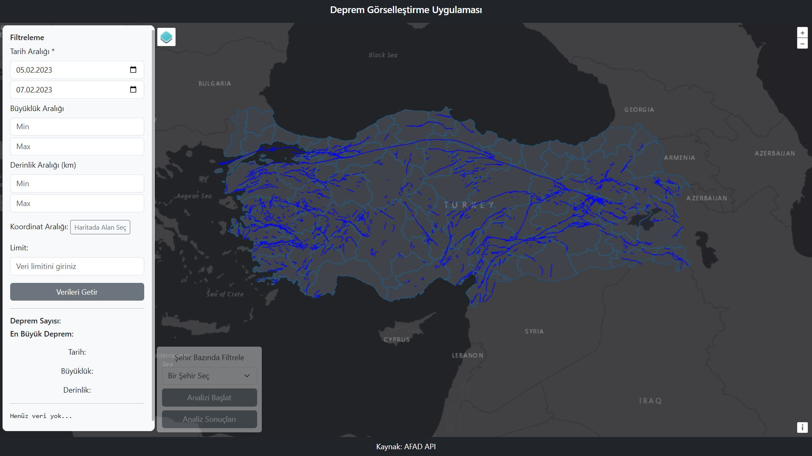
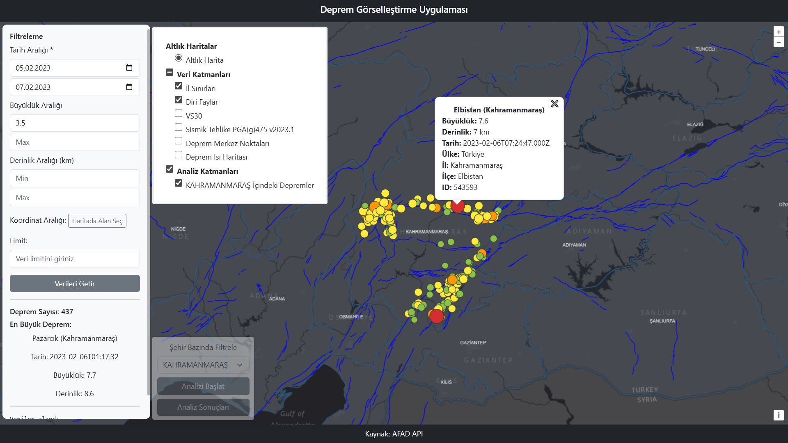
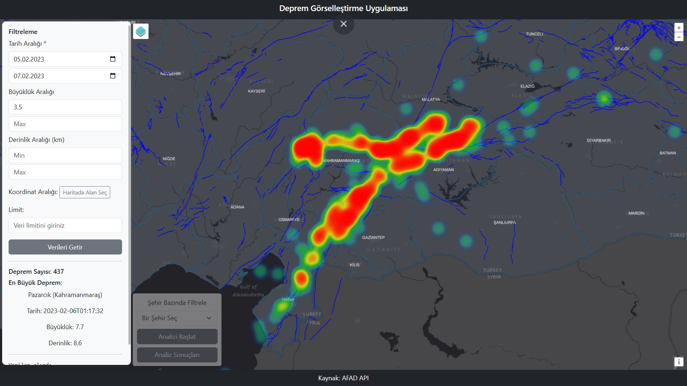
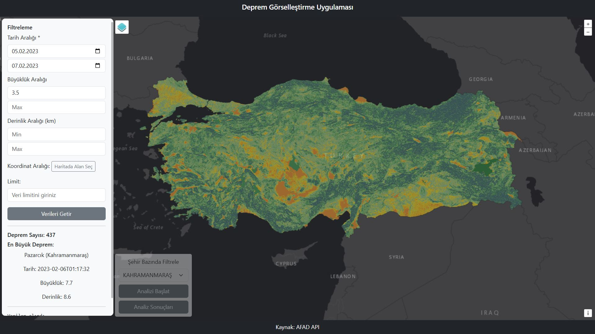
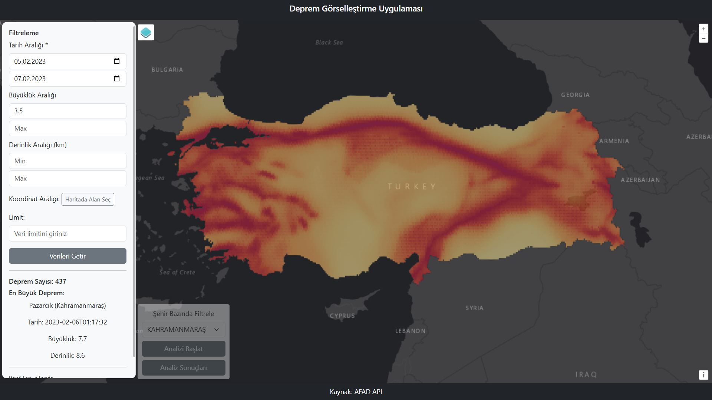

# Deprem Analiz ve Görselleştirme Uygulaması

## Genel Bakış
Bu uygulama, **AFAD Deprem API** üzerinden elde edilen deprem verilerinin web tabanlı bir harita arayüzü üzerinde görselleştirilmesini ve analiz edilmesini amaçlar. Kullanıcılar, arayüz üzerinden filtreleme yaparak belirli kriterlere uyan deprem kayıtlarını harita üzerinde görüntüleyebilir, ısı haritası (heatmap) oluşturabilir ve şehir bazlı analiz sonuçlarını grafikler aracılığıyla inceleyebilir (lejant eklenecektir).

Uygulama; mekânsal veri görselleştirme, temel analiz fonksiyonları ve kullanıcı etkileşimi odaklı bir **Web CBS (GIS)** yaklaşımıyla geliştirilmiştir.

---

## Temel Özellikler

### 1. Deprem Verilerinin Getirilmesi
- Kullanıcı arayüzünde yer alan filtreleme bileşenleri ile deprem verileri süzülür (tarih, büyüklük vb.).
- **“Verileri Getir”** butonuna basıldığında AFAD API çağrılır.
- Gelen deprem noktaları harita üzerinde **noktasal (point)** olarak görüntülenir.

### 2. Altlık Harita Üzerinde Görselleştirme
- Deprem verileri seçilen altlık harita üzerinde dinamik olarak gösterilir.
- Her bir deprem olayı coğrafi konumuna göre haritada işaretlenir.
- Noktalara tıklanarak öznitelik bilgilerine erişilebilir.

### 3. Heatmap (Isı Haritası) Oluşturma
- Getirilen deprem verilerinden otomatik olarak **ısı haritası** üretilir.
- Deprem yoğunluğunun mekânsal dağılımı görsel olarak analiz edilebilir.
- Heatmap, noktasal verilerle birlikte veya ayrı katman olarak kullanılabilir.

### 4. Şehir Bazlı Analiz
- **Analiz** butonu ile şehir sınırlarına göre mekânsal analiz gerçekleştirilir.
- Depremler, seçilen şehir sınırları içerisinde filtrelenir.
- Mekânsal kesişim (within) mantığıyla analiz yapılır.

### 5. Analiz Sonuçları ve Grafikler
- **Analiz Sonuç** butonu ile analiz çıktıları ayrı bir sonuç ekranında gösterilir.
- Sonuç ekranında grafikler yer alır:
  - Deprem sayısı dağılımları
  - Büyüklük (magnitude) istatistikleri
  - Zamansal veya mekânsal özet grafikler
- Grafikler, kullanıcıya hızlı ve anlaşılır bir değerlendirme sunar.

---

## Kullanıcı Arayüzü Akışı
1. Kullanıcı filtreleme seçeneklerini belirler.
2. **Verileri Getir** butonuna tıklar.
3. Deprem noktaları ve heatmap harita üzerinde görüntülenir.
4. Gerekirse **Analiz** butonu ile şehir bazlı analiz yapılır.
5. **Analiz Sonuç** butonu ile grafiklerin yer aldığı sonuç ekranı açılır.

---

## Kullanılan Teknolojiler
- JavaScript
- OpenLayers
- AFAD Deprem API
- HTML / CSS
- Chart.js
- PostgreSQL / Postgis
- Geoserver

---

## Amaç ve Kapsam
Bu proje, deprem verilerinin **mekânsal analiz ve görselleştirme** süreçlerini web ortamında uygulamalı olarak göstermek amacıyla geliştirilmiştir. Özellikle Web CBS, afet yönetimi ve mekânsal veri analizi konularına yönelik örnek bir uygulama niteliğindedir.

---

## Ekran Görüntüleri
Uygulamanın kullanıcı arayüzüne ve analiz çıktılara ait ekran görüntüleri aşağıdaki başlıklar altında paylaşılmıştır:

- Ana harita görünümü

  

- Seçilen sınırlamalara göre deprem noktaları

  

- Heatmap görünümü

  

- Analiz sonuç ekranı ve grafikler

  

- Raster verilerin görünümü

  
  

  <em>Solda VS30, sağda PGA.</em>

---

## Geliştirme ve Genişletme Olanakları
- Farklı analiz türlerinin eklenmesi (buffer, distance vb.).
- AHP ile ağırlık hesabı yapılıp kullanıcıya nokta bazlı deprem tehlike bilgisinin verilmesi.
- Toplanma alanları verilerinin eklenmesi.
- Kullanıcı bazlı veri indirme (GeoJSON / CSV).
- Performans ve ölçeklenebilirlik iyileştirmeleri.

---

## Veri Kaynakları

- **AFAD (T.C. İçişleri Bakanlığı)** – Deprem API  
  Türkiye geneli deprem olaylarına ait noktasal veriler.

- **MTA (Maden Tetkik ve Arama Genel Müdürlüğü)** – Türkiye Diri Fay Haritası  
  Türkiye genelindeki aktif fay hatlarını gösteren vektör veri seti.

- **USGS (United States Geological Survey)** – VS30 Site Condition Map  
  Yerel zemin koşullarını temsil eden VS30 raster verisi.

- **Global Earthquake Model (GEM)** – Global Seismic Hazard Map (PGA)  
  Küresel ölçekte olasılıksal sismik tehlike ve PGA raster verileri.  

---
Bilgi için: hamitokuyucular@gmail.com